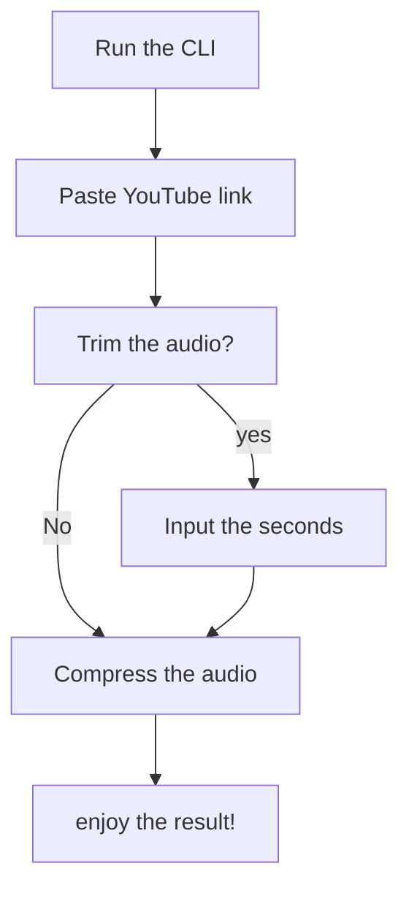

# Python YouTube MP3 Downloader
###### https://github.com/jaleisme/uts-psm-youtube-downloader

###### Meet Python YouTube MP3 Downloader, where you can download audio from your desired YouTube video using python.  Here are packages that were used in making this project:
###### 1. PyTube -> Python library to access YouTube API.
###### 2. Moviepy -> Converting mp3 audio from video.
###### 3. Soundfile -> Making sound sample frame from audio file.
###### 4. OS - Making audio segment to manipulate the audio file.
###### 5. IPython - Displaying audio.
###### Algorithm:
###### Choose the template and put it inside the root directory of the project, and simply run the project. If it was the first time you're using this project, kindly run this code on your terminal: pip install pytube moviepy soundfile pydub ffmpeg ffmpeg-python IPython
###### Link Youtube: https://youtu.be/5fufXrH_hPg

###### There's no machine learning implementation whatsoever on this project. But i do want to mention an interesting algorithm called 'Fast-fourier Transfom' or usually abbriviated as FFT. FFT is a math algorithm used to analyze signals and find their frequencies. It takes a signal and breaks it down into its frequency components, telling us which frequencies are present and how much of each. It's faster than the original Fourier Transform because it uses optimizations and mathematical properties. The FFT is used in areas like signal processing, audio processing, and image processing to perform tasks like filtering, compression, and modulation.
